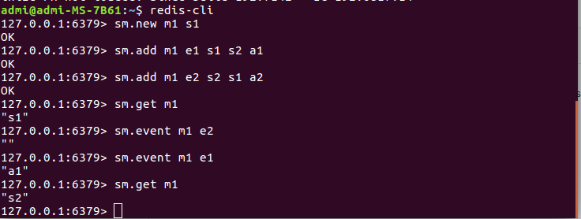

# redismachine
statemachine commands implemented in redis using rust , this module use redismodule-rs for simplicity and reducing boilerplate
(see https://github.com/ankrugold/shortprojects/tree/master/randredis for a redis-module directly using ffi)

## usage ##
### build ###
> cargo build --release
start redis-server like (or add module to redis conf)
>redis-server --loadmodule ./target/release/libredismachine.so

### commands ###

 
